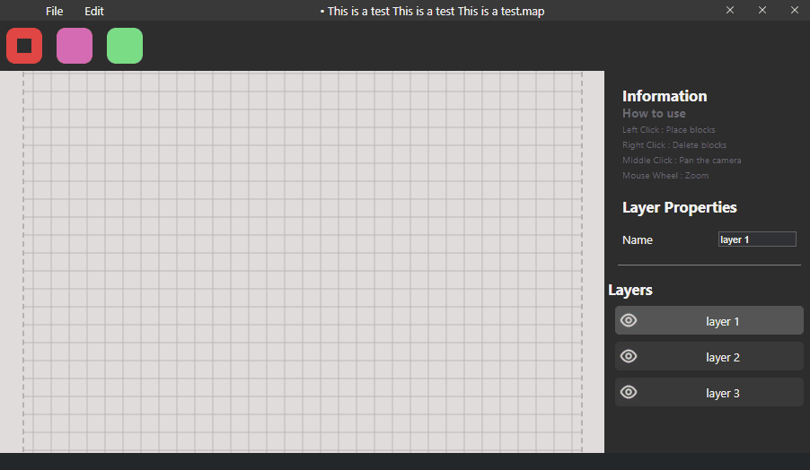

This is a prototype, the main project can be found here : [CodyAdam/project__smrtile](https://github.com/CodyAdam/project__smrtile)

# Preview

# Try it here : https://codyadam.github.io/Editor/

_Project is work in progress_

# Map Editor

-   What is it ?

I'm making a tile base map editor ([Tiled](https://www.mapeditor.org/)-like) using reactjs and electronjs to make it a desktop and browser app.

# Commands

-   Install dependencies : `npm install`

-   Start : `npm start`

-   Start with electron (during dev) : `npm run electron-dev`

-   Start with electron : `npm run electron .`
